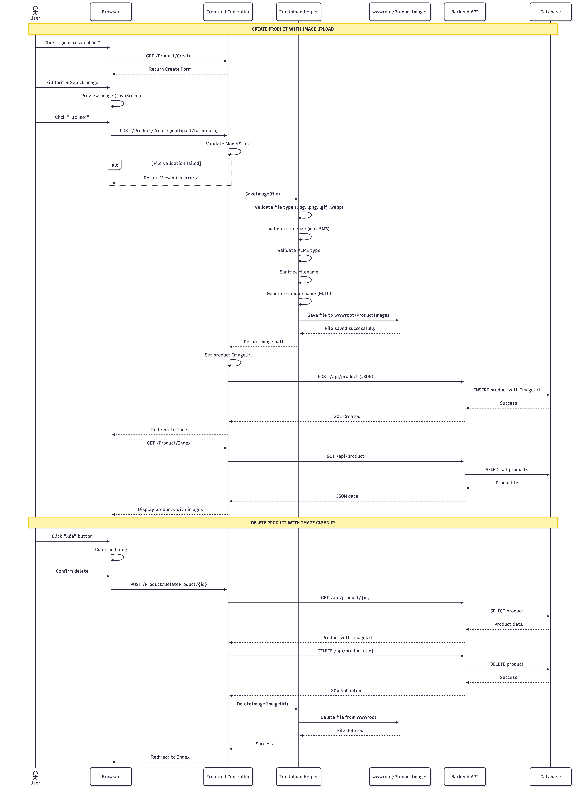
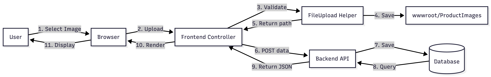
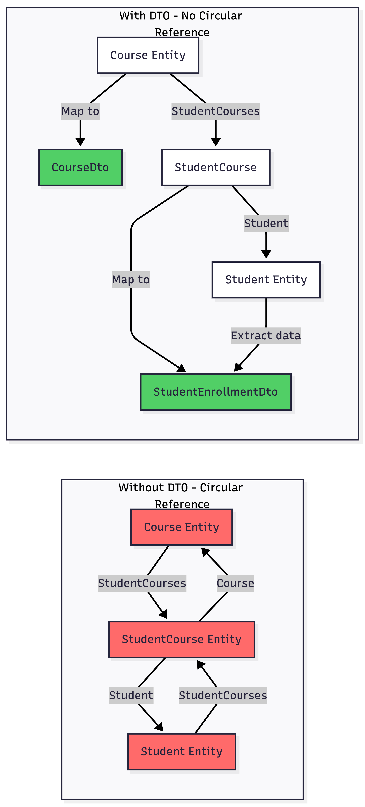
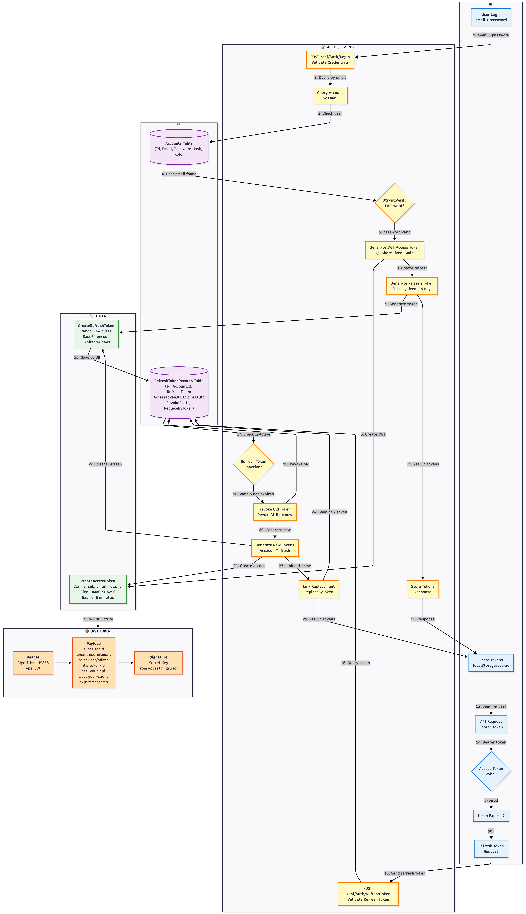
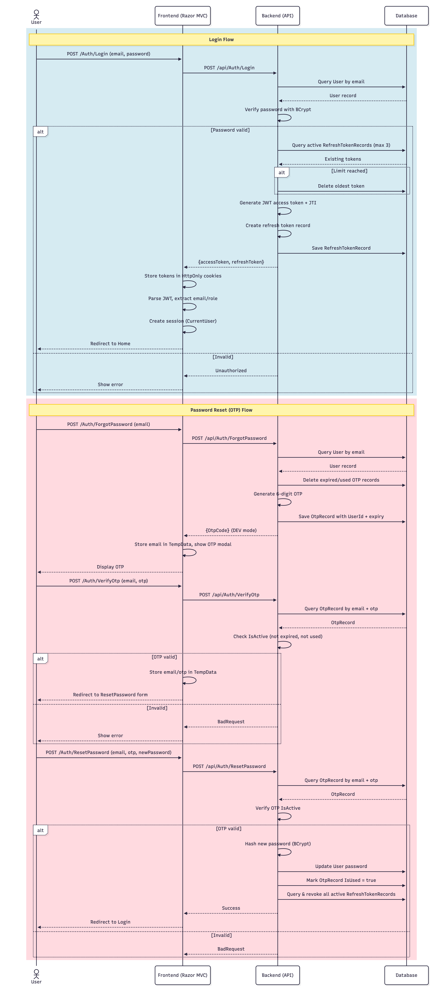
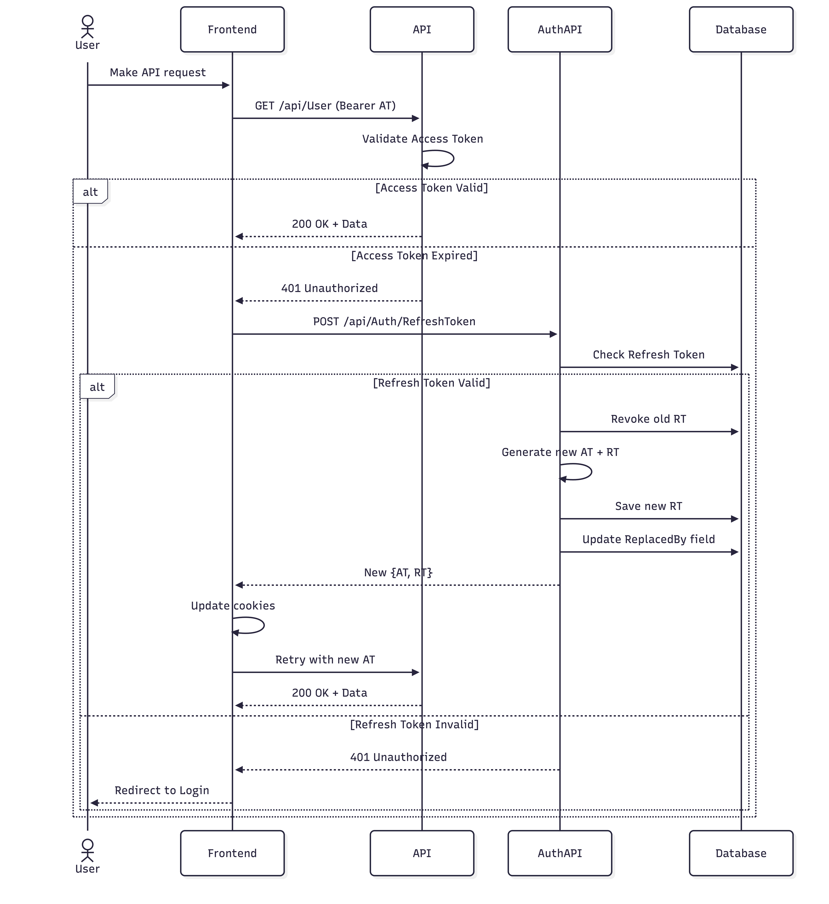

<div align="center">

# 🚀 ASP.NET Core Web API Fundamentals

**Learning-focused projects to master backend development with ASP.NET Core**

[](https://dotnet.microsoft.com/)
[](https://docs.microsoft.com/aspnet/core)
[](https://docs.microsoft.com/dotnet/csharp/)
[](LICENSE)

</div>

## 📚 About This Repository

This repository contains a progressive series of ASP.NET Core Web API projects, designed to build strong backend fundamentals through hands-on practice. Each project focuses on specific concepts and real-world scenarios.

## 🛠️ Tech Stack

<div align="left">

| Technology | Purpose |
|------------|----------|
|  | Core Framework |
|  | Programming Language |
|  | Database |
|  | Database |
|  | Containerization |
|  | Database Management |

</div>

---

## 📚 Projects

### 01. Product CRUD API

**Description:** Implement complete RESTful Product API demonstrating fundamental CRUD operations and database integration.

**Key Features:**
- RESTful CRUD endpoints (GET, POST, PUT, DELETE)
- Entity Framework Core integration
- SQL Server database with migrations
- Model validation & error handling
- Swagger UI documentation
- Async/await pattern

**Tech Stack:** ASP.NET Core Web API, EF Core, SQL Server, Swagger

<details>
<summary>📂 Project Structure</summary>

```
01_web-api_demo/
├── Controllers/
│   └── ProductController.cs
├── Data/
│   └── DataContext.cs
├── Models/
│   └── Product.cs
├── Migrations/
├── docs/
│   ├── architecture-diagram.png
│   └── sequence-diagram.png
├── Program.cs
└── appsettings.json
```

</details>

<details>
<summary>📊 Architecture Diagram</summary>


</details>

<details>
<summary>🔄 Sequence Diagram</summary>


</details>

---

### 02. One-to-Many Relationship API

**Description:** Implement complete Category-Product management system demonstrating One-to-Many relationship pattern.

**Key Features:**
- One-to-Many relationship: Category (1) → Products (Many)
- Full CRUD operations for both entities
- DTO pattern for clean API contracts
- Foreign key validation & safe navigation
- EF Core with SQL Server & Migrations
- Swagger UI with auto-redirect
- Cascade delete restriction (Restrict behavior)

**Tech Stack:** ASP.NET Core Web API, EF Core, SQL Server, Swagger

<details>
<summary>📂 Project Structure</summary>

```
02_one-to-many/
├── backend/
│   ├── Controller/
│   │   ├── CategoryController.cs
│   │   └── ProductController.cs
│   ├── Data/
│   │   └── DataContext.cs
│   ├── DTOs/
│   │   ├── CategoryDto.cs
│   │   └── ProductDto.cs
│   ├── Migrations/
│   └── Program.cs
├── frontend/
│   ├── Controllers/
│   ├── Views/
│   │   ├── Category/
│   │   ├── Product/
│   │   └── Shared/
│   └── wwwroot/
├── LModels/
│   └── Domain/
│       ├── Category.cs
│       └── Product.cs
└── docs/
    ├── demo2-project-structure.png
    └── crud-product-flow-sequence-diagram.png
```

</details>

<details>
<summary>🏗️ Project Structure</summary>


</details>

<details>
<summary>🔄 CRUD Flow Sequence Diagram</summary>


</details>

---

### 03. File Upload with Image Management

**Description:** Implement secure file upload system with image management, demonstrating file handling, validation, and storage in ASP.NET Core.

**Key Features:**
- Secure file upload with validation (type, size, MIME)
- Image preview before upload
- File storage in wwwroot with unique naming (GUID)
- File deletion with cleanup on product removal
- FileUpload helper class with security checks
- Frontend MVC with card layout UI
- Backend API with CRUD operations
- Swagger UI documentation

**Tech Stack:** ASP.NET Core Web API, ASP.NET Core MVC, EF Core, SQL Server, IFormFile

<details>
<summary>📂 Project Structure</summary>

```
03_upload-file-local/
├── backend/
│   ├── Controller/
│   │   └── ProductController.cs
│   ├── Data/
│   │   └── DataContext.cs
│   ├── DTOs/
│   │   └── ProductDto.cs
│   └── Program.cs
├── frontend/
│   ├── Controllers/
│   │   └── ProductController.cs
│   ├── Helpers/
│   │   └── FileUpload.cs
│   ├── Views/
│   │   └── Product/
│   └── wwwroot/
│       └── uploads/
├── LModels/
│   └── Domain/
│       └── Product.cs
└── docs/
    ├── upload-flow-sequence-diagram.png
    └── data-flow-diagram-simple.png
```

</details>

<details>
<summary>🔄 Upload Flow Sequence Diagram</summary>



</details>

<details>
<summary>📊 Data Flow Diagram</summary>



</details>

---

### 04. Many-to-Many Relationship API

**Description:** Implement complete Student-Course enrollment system demonstrating Many-to-Many relationship pattern with junction table.

**Key Features:**
- Many-to-Many relationship: Student (Many) ↔ Course (Many) via StudentCourse junction table
- Full CRUD operations for both Student and Course entities
- Student enrollment/removal endpoints
- DTO pattern to prevent circular reference in JSON serialization
- Nested DTOs (StudentEnrollmentDto, CourseEnrollmentDto) for clean API responses
- EF Core Include/ThenInclude for eager loading
- Composite primary key in junction table
- Duplicate enrollment prevention
- Swagger UI with auto-redirect

**Tech Stack:** ASP.NET Core Web API, EF Core, SQL Server, Swagger

<details>
<summary>📂 Project Structure</summary>

```
04_many-to-many/
├── Controllers/
│   ├── CourseController.cs
│   └── StudentController.cs
├── Data/
│   └── DataContext.cs
├── Models/
│   ├── Course.cs
│   ├── Student.cs
│   └── StudentCourse.cs
├── DTOs/
│   ├── CourseDto.cs
│   └── StudentDto.cs
├── Migrations/
├── docs/
│   ├── enrollment-flow-sequence-diagram.png
│   └── DTO-mapping-flow-circular-reference-prevention.png
├── Program.cs
└── appsettings.json
```

</details>

<details>
<summary>🔄 Enrollment Flow Sequence Diagram</summary>


</details>

<details>
<summary>🔄 DTO Mapping Flow - Circular Reference Prevention</summary>



</details>

---

### 05. JWT Authentication with Refresh Token

**Description:** Implement secure JWT-based authentication system with Access Token and Refresh Token rotation, demonstrating modern authentication patterns in ASP.NET Core.

**Key Features:**
- JWT Access Token & Refresh Token implementation
- Token rotation with automatic refresh mechanism
- Secure token storage (HttpOnly cookies)
- Refresh Token revocation & replacement tracking
- Password hashing with BCrypt
- Bearer token authentication middleware
- Repository pattern for data access
- Frontend MVC with login/logout flow
- Backend API with separate AuthAPI service
- Token expiration handling (401 Unauthorized)

**Tech Stack:** ASP.NET Core Web API, ASP.NET Core MVC, JWT, BCrypt, EF Core, SQL Server

<details>
<summary>📂 Project Structure</summary>

```
05_authentication_practice/
├── backend/
│   ├── Controllers/
│   │   ├── AuthController.cs
│   │   └── UserController.cs
│   ├── Data/
│   │   └── DataContext.cs
│   ├── DTOs/
│   │   ├── LoginDto.cs
│   │   ├── AuthResponseDto.cs
│   │   └── RefreshTokenRequestDto.cs
│   ├── Repository/
│   ├── Services/
│   │   └── TokenService.cs
│   ├── Migrations/
│   └── Program.cs
├── frontend/
│   ├── Controllers/
│   │   └── AuthController.cs
│   ├── Helpers/
│   ├── Views/
│   │   ├── Auth/
│   │   └── Shared/
│   └── wwwroot/
├── Shared/
│   └── Domain/
│       ├── User.cs
│       └── RefreshTokenRecord.cs
└── docs/
    ├── jwt-authentication-flow-diagram.png
    ├── JWT-based-authentication-sequence-diagram.png
    └── token-refresh-flow.png
```

</details>

<details>
<summary>🔐 JWT Authentication Flow Diagram</summary>



</details>

<details>
<summary>🔄 JWT-Based Authentication Sequence Diagram</summary>



</details>

<details>
<summary>🔄 Token Refresh Flow</summary>



</details>

---

## 🎯 Learning Path

### ✅ Completed
- [x] **01_web-api_demo** - Initial Web API setup
- [x] **02_one-to-many** - One-to-Many relationship with EF Core
- [x] **03_upload-file-local** - File upload with image management
- [x] **04_many-to-many** - Many-to-Many relationship with junction table
- [x] **05_authentication_practice** - JWT Authentication with Refresh Token

### 🔄 In Progress
- [ ] **06_*** - TBD

### Planned Topics
- Entity Framework Core & Database Integration
- Authentication & Authorization (JWT)
- Repository Pattern & Clean Architecture
- File Upload/Download
- Pagination, Filtering & Sorting
- API Versioning
- Caching Strategies
- Error Handling & Logging
- Unit & Integration Testing
- Docker & Deployment

## 🚀 Getting Started

### Prerequisites
```bash
# Check .NET version
dotnet --version  # Should be 8.0 or higher
```

### Running a Project
```bash
# Navigate to project folder
cd 01_web-api_demo

# Restore dependencies
dotnet restore

# Run the project
dotnet run
```

## 📖 Resources

- [Official ASP.NET Core Documentation](https://docs.microsoft.com/aspnet/core)
- [.NET API Guidelines](https://github.com/microsoft/api-guidelines)
- [RESTful API Best Practices](https://restfulapi.net/)

## 📝 Notes

This is a personal learning repository. Each project builds upon previous concepts, creating a comprehensive understanding of ASP.NET Core Web API development.

---

<div align="center">

**Built with ❤️ for learning and growth**

</div>
