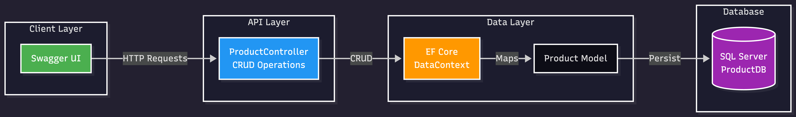
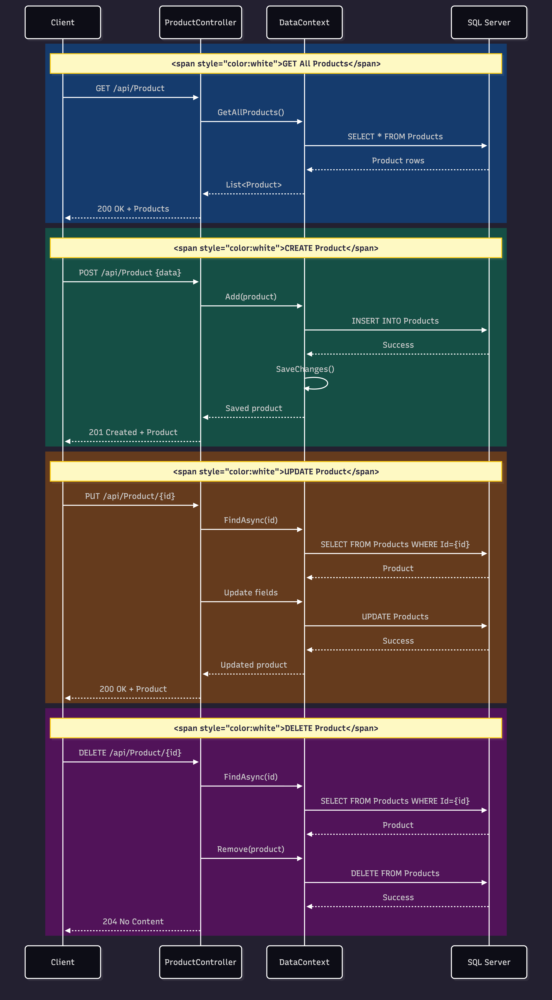
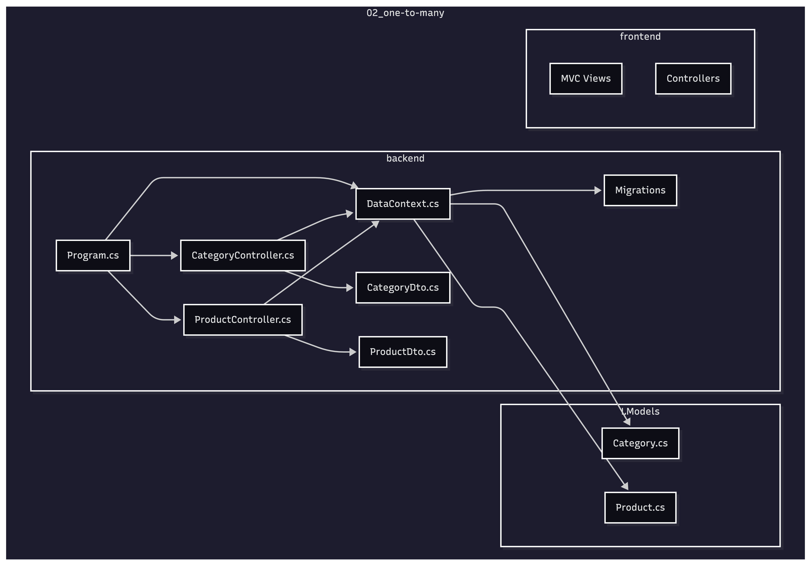
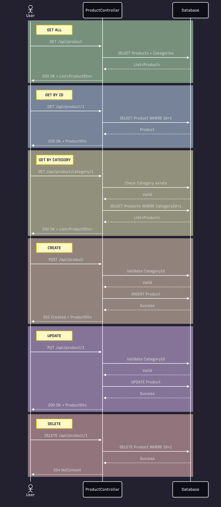

<div align="center">

# 🚀 ASP.NET Core Web API Fundamentals

**Learning-focused projects to master backend development with ASP.NET Core**

[](https://dotnet.microsoft.com/)
[](https://docs.microsoft.com/aspnet/core)
[](https://docs.microsoft.com/dotnet/csharp/)
[](LICENSE)

</div>

---

## 📚 About This Repository

This repository contains a progressive series of ASP.NET Core Web API projects, designed to build strong backend fundamentals through hands-on practice. Each project focuses on specific concepts and real-world scenarios.

## 🛠️ Tech Stack

<div align="left">

| Technology | Purpose |
|------------|----------|
|  | Core Framework |
|  | Programming Language |
|  | Database |
|  | Database |
|  | Containerization |
|  | Database Management |

</div>

## 📂 Project Structure

```
dotnet-webapi-fundamentals/
├── 01_web-api_demo/          # Basic Web API setup
│   ├── Controllers/          # API Controllers
│   ├── Data/                 # DbContext
│   ├── Models/               # Domain Models
│   ├── Migrations/           # EF Core Migrations
│   └── docs/                 # Architecture diagrams
│
├── 02_one-to-many/           # One-to-Many relationship demo
│   ├── backend/              # Web API Project
│   │   ├── Controller/       # CategoryController, ProductController
│   │   ├── Data/             # DataContext with relationships
│   │   ├── DTOs/             # Data Transfer Objects
│   │   ├── Migrations/       # Database migrations
│   │   └── Program.cs        # API configuration + Swagger
│   │
│   ├── frontend/             # MVC Project
│   │   ├── Controllers/      # CategoryController, ProductController
│   │   ├── Views/
│   │   │   ├── Category/     # CRUD views for Category
│   │   │   ├── Product/      # CRUD views for Product
│   │   │   └── Shared/       # Layout, validation scripts
│   │   └── wwwroot/          # Static files (CSS, JS)
│   │
│   ├── LModels/              # Shared Class Library
│   │   └── Domain/           # Category.cs, Product.cs
│   │
│   └── docs/                 # Project diagrams
│
├── 03_*/                     # Coming soon...
└── README.md
```

---

## 📚 Projects

### 01. Product CRUD API

**Description:** Implement complete RESTful Product API demonstrating fundamental CRUD operations and database integration.

**Key Features:**
- RESTful CRUD endpoints (GET, POST, PUT, DELETE)
- Entity Framework Core integration
- SQL Server database with migrations
- Model validation & error handling
- Swagger UI documentation
- Async/await pattern

**Tech Stack:** ASP.NET Core Web API, EF Core, SQL Server, Swagger

<details>
<summary>📊 Architecture Diagram</summary>



</details>

<details>
<summary>🔄 Sequence Diagram</summary>



</details>

---

### 02. One-to-Many Relationship API

**Description:** Implement complete Category-Product management system demonstrating One-to-Many relationship pattern.

**Key Features:**
- One-to-Many relationship: Category (1) → Products (Many)
- Full CRUD operations for both entities
- DTO pattern for clean API contracts
- Foreign key validation & safe navigation
- EF Core with SQL Server & Migrations
- Swagger UI with auto-redirect
- Cascade delete restriction (Restrict behavior)

**Tech Stack:** ASP.NET Core Web API, EF Core, SQL Server, Swagger

<details>
<summary>🏗️ Project Structure</summary>



</details>

<details>
<summary>🔄 CRUD Flow Sequence Diagram</summary>



</details>

---

## 🎯 Learning Path

### Completed
- [x] **01_web-api_demo** - Initial Web API setup
- [x] **02_one-to-many** - One-to-Many relationship with EF Core

### In Progress
- [ ] **03_*** - TBD

### Planned Topics
- Entity Framework Core & Database Integration
- Authentication & Authorization (JWT)
- Repository Pattern & Clean Architecture
- File Upload/Download
- Pagination, Filtering & Sorting
- API Versioning
- Caching Strategies
- Error Handling & Logging
- Unit & Integration Testing
- Docker & Deployment

## 🚀 Getting Started

### Prerequisites
```bash
# Check .NET version
dotnet --version  # Should be 8.0 or higher
```

### Running a Project
```bash
# Navigate to project folder
cd 01_web-api_demo

# Restore dependencies
dotnet restore

# Run the project
dotnet run
```

## 📖 Resources

- [Official ASP.NET Core Documentation](https://docs.microsoft.com/aspnet/core)
- [.NET API Guidelines](https://github.com/microsoft/api-guidelines)
- [RESTful API Best Practices](https://restfulapi.net/)

## 📝 Notes

This is a personal learning repository. Each project builds upon previous concepts, creating a comprehensive understanding of ASP.NET Core Web API development.

---

<div align="center">

**Built with ❤️ for learning and growth**

</div>
